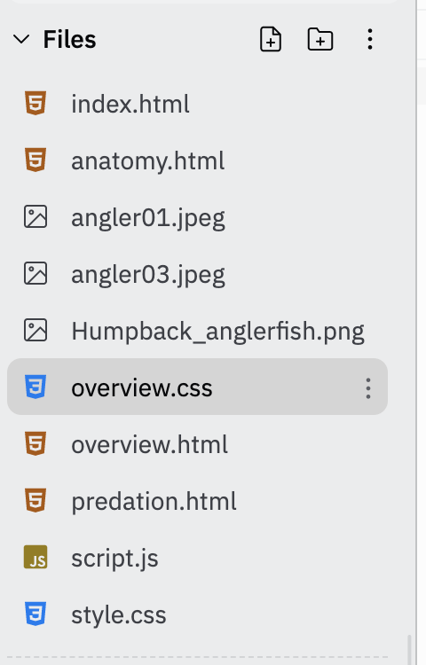

# Creating a Website With Multiple pages

You can use ```<a>``` tags or hyperlinks to create a website with multiple ```.html``` pages.

## Task 1

Look at your file tree.  You should  see 4 different ```.html``` files.  

## Task 2

Let's create a hyperlink on the home page that will direct the viewer to the ```overview.html``` page.

Find the element ```<h3 class="home">Overview</h3>``` on ```index.html```. (It's on line 18).

Make the element a hyperlink pointing to ```overview.html``` by nesting it inside ```<a>``` tags like this:

```
<a href="overview.html"><h3 class="home">Overview</h3></a>

```

Run the code and test the link by clicking the word **Overview**.

We know that the ```href``` attribute specifies the URL of the page the link goes to.  When ```.html``` pages are in the same file folder, all you need to do is point the ```href``` to the specific file name.

## Task 3

Click on ```overview.html``` in your file tree.  At the bottom of the page you will see ```<h3 class="overview">Home</h3>```.

Make the element a hyperlink pointing back to ```index.html``` by nesting it inside ```<a>``` tags like this:

```
<a href="index.html"><h3 class="overview">Home</h3></a>

```
  
 ## Task 4

 On ```.index.html``` turn the ```<h3>``` elements **Anatomy** and **Predation** into hyperlinks pointing to the respective pages.

 ## Task 5

 Create links pointing back to ```index.html``` on the **Anatomy** and **Predation** pages.

 ## Multiple Style Sheets

 A website can have multiple style sheets. This is a much simpler way to apply different styles to pages.

 ## Task 6

To create a new style sheet, go to the New File icon in your file tree:


Click the icon and you will see an area to type your file name:


Name the file ```overview.css```:


You should see ```overview.css``` in your file tree now.



## Task 7

Go to ```overview.html```.

Look at the ```<head>``` area of the page.  On line 8 you should see this line of code:

```
<link href="style.css" rel="stylesheet" type="text/css" />
```

This code ```link href="style.css"``` tells your browser which style sheet to use.

Change ```link href="style.css"``` to ```link href="overview.css"```

## Task 8

Now go to the ```overview.css```.

Use to CSS to make the overview page unique. Change three things (background-color, font, font colors, etc) on the page.

The Overview page should now have a unique style.

## Task 9

Change the style sheet link ( ```link href="style.css"```) on the **Anatomy** and **Predation** page so that they use the styles from ```overview.css```.